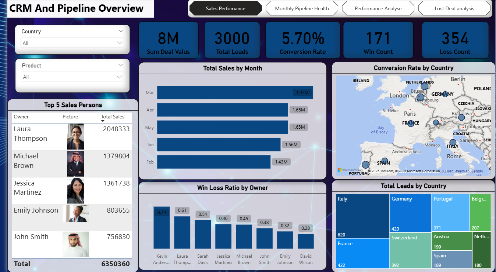
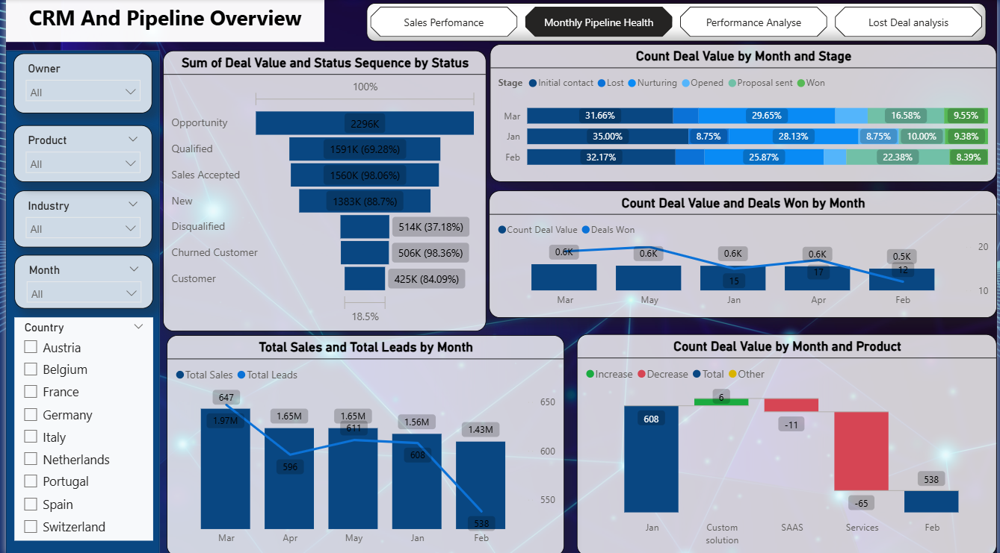
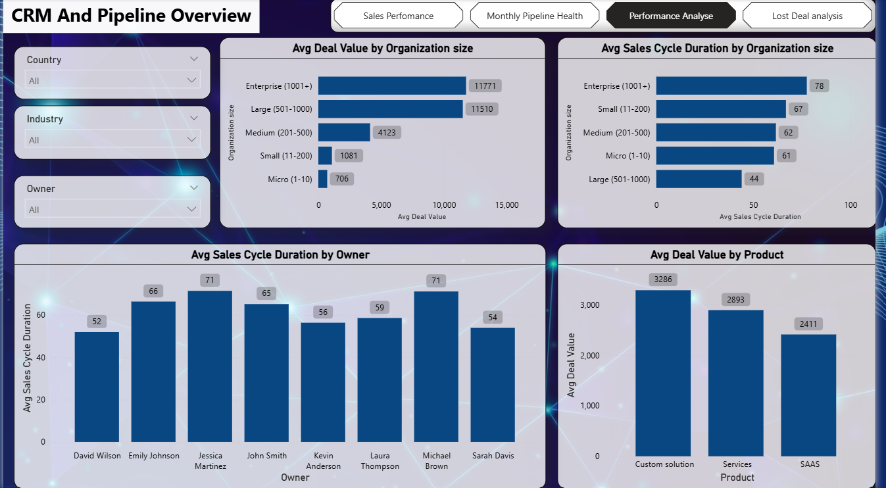
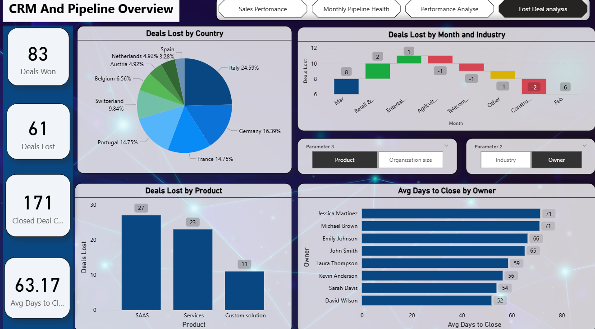
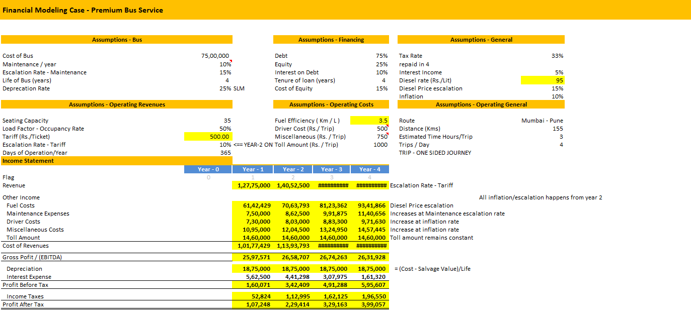
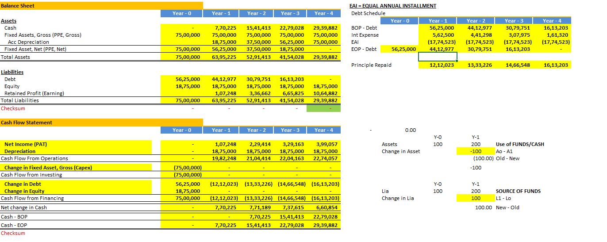
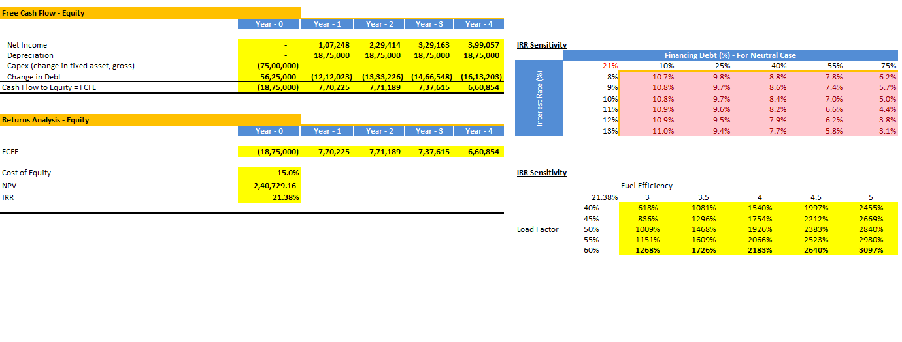

# Hi, I'm Nihal Abdulla
### Data Analyst | Data-Driven Decision Making | Transforming Insights into Impact |

<!--Section 1: Introduction-->

## 🌟 About Me  
Innovative Data Analyst with an MSc in Financial Economics and hands-on experience in Data visualization, Data modelling, and financial forecasting.
Proficient in transforming complex datasets into actionable business insights using **Power BI**, **Excel**, **DAX**, **SQL** and **Tableau**.
I build dynamic dashboards, streamline reporting workflows, and support data-driven decision-making.
🚀 Let’s turn data into impactful stories!  

---

## 🎓 Education  
- **Master of Science in Financial Economics**  
  *Gokhale Institute of Politics and Economics, Pune, India (2022 – 2024)*

- **Bachelor of Arts in Economics**  
  *University of Calicut, Calicut, Kerala, India (2019 – 2022)*
  

---

## 💼 Work Experience  

### 🔹 Data Analyst Intern — *Rows & Columns, Kozhikode*  
- Performed data cleaning, transformation, and validation using **SQL** and **Advanced Excel (Power Query, Pivot Tables, formulas)** to ensure data accuracy and reporting integrity.  
- Developed and optimized **Power BI** data models, including relationships and calculated measures, to support **KPI tracking, performance analysis, and management reporting**.
- Delivered actionable business insights and improved data-driven decision-making across teams
  
### 🔹 Assistant Professor — *Government Model Engineering College, Cochin, Kerala*  
- Designed and delivered lectures on Industrial Economics and Foreign Trade, emphasizing data-driven insights into market structures and trade policies.
- Developed and delivered interactive lectures using real-world case studies and data analysis to illustrate complex economic theories effectively.
- Mentored **500+** engineering students in applying economic principles to real world industrial and trade scenarios using case studies and data analysis.

---

## 📊 Projects  

###  HR Analytics Dashboard 
- 🌍 Designed an HR Analytics dashboard using **MySQL and Power BI** to analyse employee demographics, salary trends, departmental performance, and workforce health.
- 🔍 Built **SQL views with joins across multiple tables** to extract hire, resignation, payroll, and department-level data for KPI reporting and attrition analysis.
- 📈 Generated actionable insights on gender imbalance, high-paying departments, declining salary trends, and rising attrition, supporting data-driven HR decision-making 

---

### CRM Sales Performance & Pipeline Analysis Dashboard  
- 🏨 Developed an interactive **Power BI dashboard analyzing 3,000+ CRM records totalling 8.2M+ in deal value**, providing insights on sales agent performance, conversion rates, and deal trends.
- 💡 Constructed **10+ DAX calculations** and data models to track KPIs including conversion rates, sales cycle durations, and product wise deal closures across multiple countries and industries.
- 📊 Delivered actionable, user-friendly visuals maps, funnels, bar charts, and scatter plots enabling data driven pipeline optimization and strategic sales decision-making. 

---

### Financial Modelling: Premium Bus Service Feasibility
- 🏨 Designed detailed financial statements, including Income, Cash Flow, and Balance Sheets, for business evaluation. 
- 💡 Applied **Net Present Value (NPV) and Internal Rate of Return (IRR)** to determine project viability.
- 📊 Provided actionable insights through data visualization and financial projections for strategic decision-making .

---

## 📜 Certifications  
- ✅ IBM - Excel Basics for Data Analysis (Coursera) 
- ✅	IBM - Introduction to Data Analytics (Coursera)  

---

## 🧠 Tools & Skills  
 
 
 
    

---

## 📫 Contact Details  
*Let’s connect and see how we can make a difference together!*  

<table>
  <tbody>
    <tr>
      <td>📧</td>
      <td><a href="mailto:nihalabdullamuyippoth@gmail.com">nihalabdullamuyippoth@gmail.com</a></td>
    </tr>
    <tr>
      <td>📞</td>
      <td>(+974) 59984136</td>
    </tr>
    <tr>
      <td>📍</td>
      <td>Al Aziziyah, Doha, Qatar</td>
    </tr>
    <tr>
      <td>⬇️</td>
      <td><a href="Nihal Abdulla Analyst Resume.pdf">Download my CV</a></td>
    </tr>
    <tr>
      <td>🌐</td>
      <td><a href="https://www.linkedin.com/in/nihalabdullam">Let’s connect on LinkedIn</a></td>
    </tr>
  </tbody>
</table>

