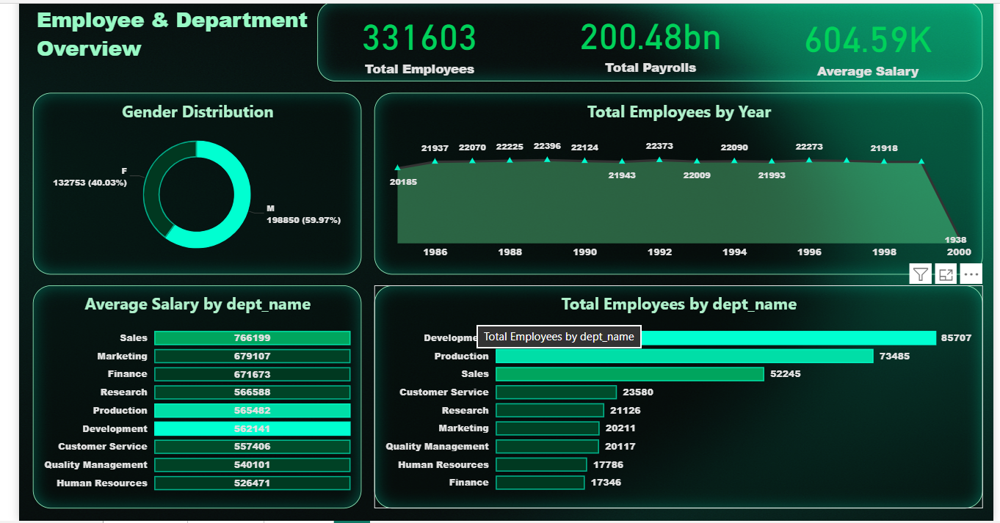
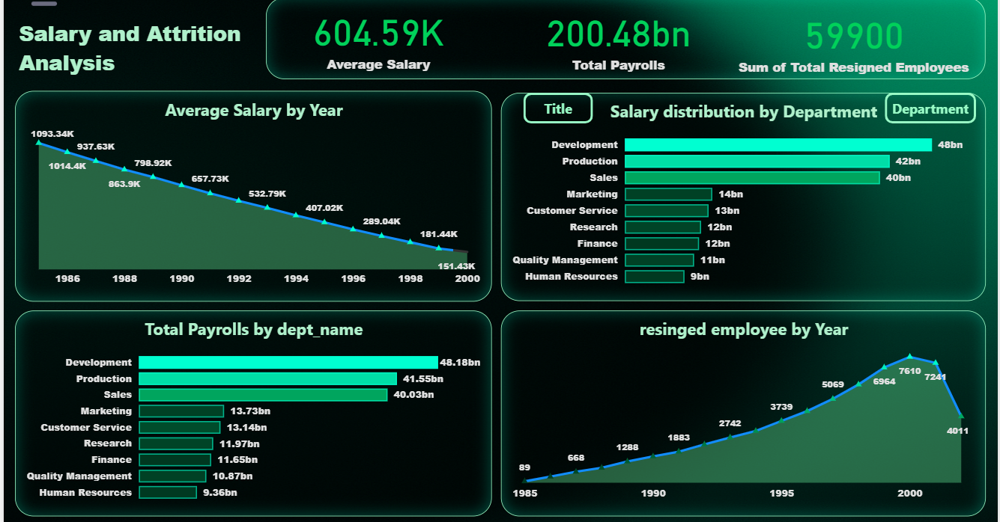

# Hi, I'm Nihal Abdulla
### Data Analyst | Data-Driven Decision Making | Transforming Insights into Impact |

<!--Section 1: Introduction-->

## 🌟 About Me  
Innovative Data Analyst with an MSc in Financial Economics and hands-on experience in Data visualization, Data modelling, and financial forecasting.
Proficient in transforming complex datasets into actionable business insights using **Power BI**, **Excel**, **DAX**, **SQL** and **Tableau**.
I build dynamic dashboards, streamline reporting workflows, and support data-driven decision-making.
🚀 Let’s turn data into impactful stories!  

---

## 🎓 Education  
- **Master of Science in Financial Economics**  
  *Gokhale Institute of Politics and Economics, Pune, India (2022 – 2024)*

- **Bachelor of Arts in Economics**  
  *University of Calicut, Calicut, Kerala, India (2019 – 2022)*
  

---

## 💼 Work Experience  

### 🔹 Data Analyst Intern — *Rows & Columns, Kozhikode*  
- Performed data cleaning, transformation, and validation using **SQL** and **Advanced Excel (Power Query, Pivot Tables, formulas)** to ensure data accuracy and reporting integrity.  
- Developed and optimized **Power BI** data models, including relationships and calculated measures, to support **KPI tracking, performance analysis, and management reporting**.
- Delivered actionable business insights and improved data-driven decision-making across teams
  
### 🔹 Assistant Professor — *Government Model Engineering College, Cochin, Kerala*  
- Designed and delivered lectures on Industrial Economics and Foreign Trade, emphasizing data-driven insights into market structures and trade policies.
- Developed and delivered interactive lectures using real-world case studies and data analysis to illustrate complex economic theories effectively.
- Mentored **500+** engineering students in applying economic principles to real world industrial and trade scenarios using case studies and data analysis.

---

## 📊 Projects  

###  HR Analytics Dashboard 
🌍 Designed an HR Analytics dashboard using **MySQL and Power BI** to analyse employee demographics, salary trends, departmental performance, and workforce health
🔍 Built **SQL views with joins across multiple tables** to extract hire, resignation, payroll, and department-level data for KPI reporting and attrition analysis  
📈 Generated actionable insights on gender imbalance, high-paying departments, declining salary trends, and rising attrition, supporting data-driven HR decision-making 

---

### Hospitality Analysis – [Power BI and Excel]  
🏨 AtliQ Grands faced declining market share and revenue due to poor management decisions.  
💡 Developed interactive dashboards to analyze key metrics, including RevPAR, ADR, and occupancy.  
📊 Insights supported decision-making for enhanced performance.  

